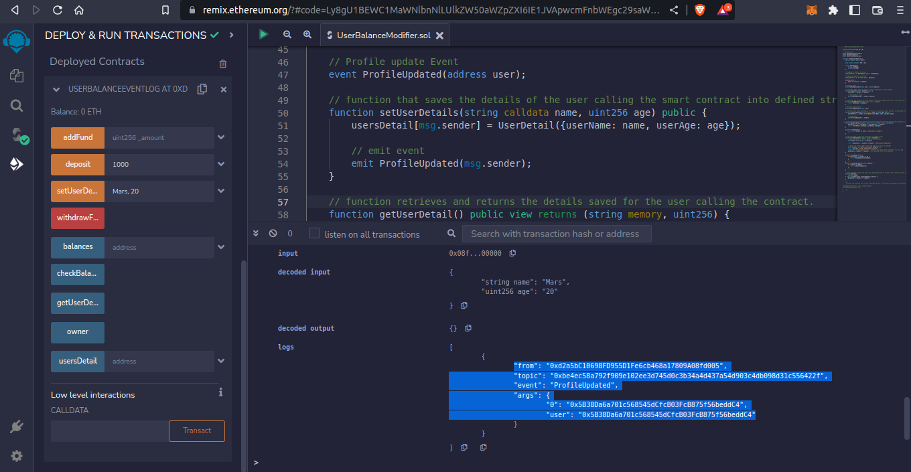

# Task - Events

- Growic Solidity Developer Program

Smart contract that saves user balance.
This contract has functions that saves the amount a user is depositing into a mapping and a function that searches for user balance inside the mapping and returns the balance of who calls the contract.
And functions allows users to save and retrieve their additional info into the smart contract as a KYC measure.

- The Modifiers ensures that access are granted only to the owner and depositors when the WithdrawFund and AddFund functions are called respectively.

- The events FundsDeposited() and ProfileUpdated() logs data to the client or front-end when the deposit() and setUserDetails() functions are called respectively

## Sample Output I

Calling the deposit() function

## Sample Output II

Calling the setUserDetails() function

## Sample Out III

Calling the setUserDetails() function with more parameters added to the ProfileUpdated() event

